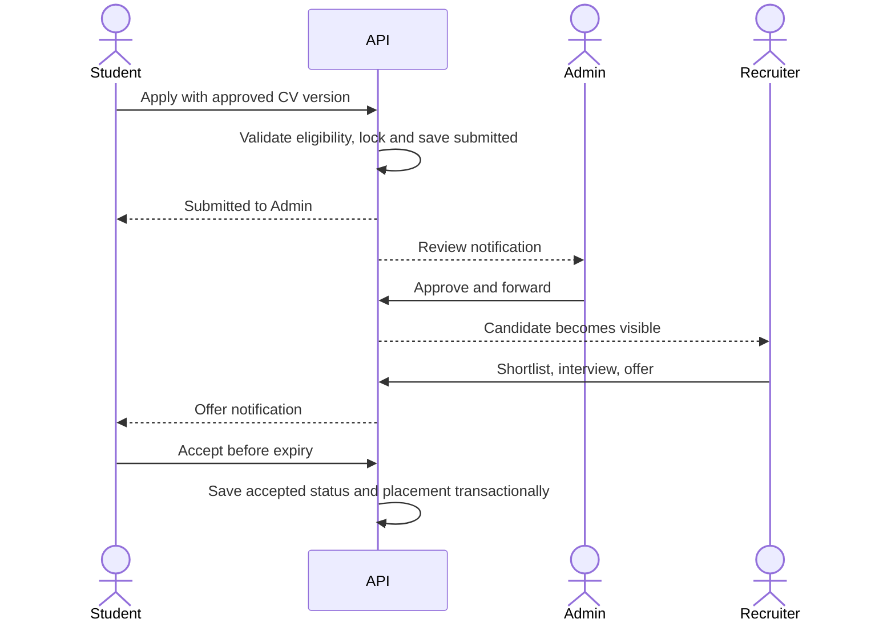

# Application workflow

```mermaid
sequenceDiagram
  actor Student
  participant API
  actor Admin
  actor Recruiter
  Student->>API: Apply with approved CV version
  API->>API: Validate eligibility, lock and save submitted
  API-->>Student: Submitted to Admin
  API-->>Admin: Review notification
  Admin->>API: Approve and forward
  API-->>Recruiter: Candidate becomes visible
  Recruiter->>API: Shortlist, interview, offer
  API-->>Student: Offer notification
  Student->>API: Accept before expiry
  API->>API: Save accepted status and placement transactionally
```
