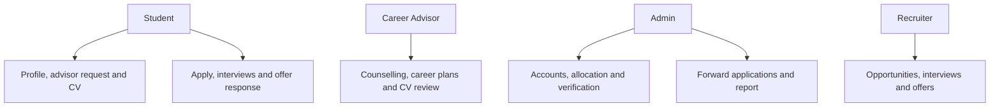

# Use cases

```mermaid
flowchart TD
  S[Student] --> P[Profile, advisor request and CV]
  S --> A[Apply, interviews and offer response]
  C[Career Advisor] --> R[Counselling, career plans and CV review]
  D[Admin] --> U[Accounts, allocation and verification]
  D --> F[Forward applications and report]
  E[Recruiter] --> H[Opportunities, interviews and offers]
```
